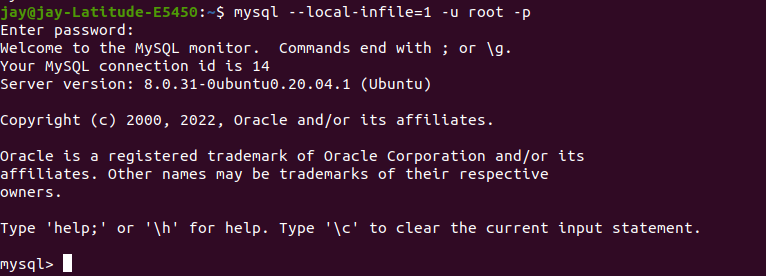

# Exploring the prices of Maize flour in Uganda
About Dataset
Context:

Global food price fluctuations can cause famine and large population shifts. Price changes are increasingly critical to policymakers as global warming threatens to destabilize the food supply.
Content:

Over 740k rows of prices obtained in developing world markets for various goods. Data includes information on country, market, price of good in local currency, quantity of good, and month recorded.
Acknowledgements:

Compiled by the World Food Program and distributed by HDX.
Inspiration:

This data would be particularly interesting to pair with currency fluctuations, weather patterns, and/or refugee movements--do any price changes in certain staples predict population upheaval? Do certain weather conditions influence market prices?
License:

Released under Chttps://www.kaggle.com/datasets/jboysen/global-food-prices?resource=downloadC BY-IGO.

# Conclusion 
- The Data was collected in eight different years
- The Data was collected in seven districts
- The currency that was used was UGX
- The standard deviation of the prices of maize flour was UGX469.14
- The average price of Maize Flour was 1694.10 UGX 

# Open the csv in Excel
I take a look at the data in excel first to know the kind of headers that am dealing with 

# Log into sql 
I log into sql using ubuntu terminal to create a database where the data will be imported to

# Create a Database to hold the file

# Show databases in the mysql server to show that the database has been created 

# Create a table in the newly created database

# Close the mysql server

# Open the mysql server while enabling it to import data from another file

# Import All the Data from other csv file into the newly created table

# check to confirm the import of the data

# Change the column data columns to their appropiate data types

